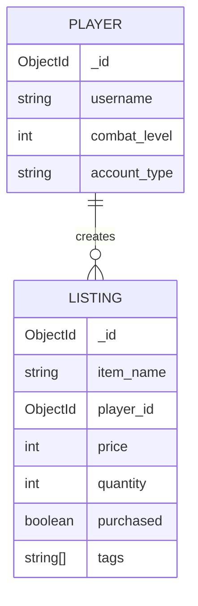

# MongoDB Exercises

## Table of Contents 
- [Exercise 1: Inserting Documents](#exercise-1-inserting-documents)
- [Exercise 2 & 3: Finding Documents](#exercise-2--3-finding-documents)
- [Exercise 4: Updating Documents](#exercise-4-updating-documents)
- [Exercise 5: Deleting Documents](#exercise-5-deleting-documents)
- [Exercise 6: Aggregation](#exercise-6-aggregation)
- [Exercise 7: Referential Integrity Issue](#exercise-7-referential-integrity-issue)
- [Exercise 8: Entity Relationship Diagram](#exercise-8-entity-relationship-diagram)
- [Exercise 9: Creating and Populating Database](#exercise-9-creating-and-populating-database)
- [Pictures](#pictures)

---

## Exercise 1: Inserting Documents

### 1.1 Insert a Single Document
```javascript
try {
   db.books.insertOne( {
       title: "Pride and Prejudice",
       author: "Jane Austen",
       year: 1813,
       genres: ["Romance", "Classic", "Fiction"],
       copies: 3,
       ebook: false
   });
} catch (e) {
   print(e);
}
```

### 1.2 Insert Multiple Documents
```javascript
db.books.insertMany([
  {
    title: "War and Peace",
    author: "Leo Tolstoy",
    year: 1869,
    genres: ["Historical Fiction", "Classic", "Philosophical Fiction"],
    copies: 84,
    ebook: true
  },
  {
    title: "The Lord of the Rings: The Fellowship of the Ring",
    author: "John Ronald Reuel Tolkien",
    year: 1954,
    genres: ["Fantasy", "Adventure", "Epic"],
    copies: 0,
    ebook: false
  }
]);
```

### 1.3 List All Books
```javascript
db.books.find({})
```

---

## Exercise 2 & 3: Finding Documents

### 2.1 Find by Title
```javascript
db.books.find({ title: "To Kill a Mockingbird" })
db.books.find({ title: "The Hobbit" })
```

### 2.2 Find by ID
```javascript
db.books.find({ _id: ObjectId("67a09582564fca59f78a7e99") })
```

### 2.3 Find Books with More Than 15 Copies
```javascript
db.books.find({ copies: { $gt: 15 } })
```

---

## Exercise 4: Updating Documents

### 3.1 Update "The Hobbit" Year and Ebook Status
```javascript
db.books.updateOne({ title: "The Hobbit" }, { $set: { year: 1937, ebook: true } })
```

### 3.2 Set Copies to Zero for Tolkien's Books
```javascript
db.books.updateMany({ author: "John Ronald Reuel Tolkien" }, { $set: { copies: 0 } })
```

---

## Exercise 5: Deleting Documents

### 4.1 Delete "Pride and Prejudice"
```javascript
db.books.deleteOne({ title: "Pride and Prejudice" })
```

### 4.2 Delete Books with No Copies That Are Ebooks
```javascript
db.books.deleteMany({ $and: [ { copies: 0 }, { ebook: true } ] })
```

---

## Exercise 6: Aggregation

### 5.1 Count Total Books
```javascript
db.books.aggregate([{ $count: "total_books" }])
```

### 5.2 Sum of All Copies
```javascript
db.books.aggregate([{ $group: { _id: null, total_copies: { $sum: "$copies" } } }])
```

---

## Exercise 7: Referential Integrity Issue
In MongoDB, lack of referential integrity may cause issues when an author is deleted, leading to books referencing a non-existent author. This can break queries that expect an author field.

---

## Exercise 8: Entity Relationship Diagram

#### Entity Relationship Diagram for runescape_market:
- **PLAYER** entity can have **multiple LISTING** entities (one-to-many relationship).
- Each **LISTING** references a **PLAYER** via `player_id`.
- `PLAYER` stores the player's username, combat level, and account type as attributes with specified data types.
- `LISTING` contains item details, price, quantity, and status as attributes with specified data types.



**PLAYER JSON**

```
  {
    "_id": "507f191e810c19729de860ea",
    "username": "Zezima",
    "combat_level": 126,
    "account_type": "Regular"
  },
  {
    "_id": "507f191e810c19729de860eb",
    "username": "Iron Bob",
    "combat_level": 89,
    "account_type": "Ironman"
  }
```

**LISTING JSON**

```
  {
    "_id": "609c5a1b9b1d4c2f1e3f1a89",
    "player_id": "507f191e810c19729de860ea",
    "item_name": "Abyssal Whip",
    "price": 2000000,
    "quantity": 1,
    "purchased": true,
    "tags": ["abyssal", "slash"]

  },
  {
    "_id": "609c5a1b9b1d4c2f1e3f1a90",
    "player_id": "507f191e810c19729de860eb",
    "item_name": "Rune Scimitar",
    "price": 15000,
    "quantity": 2,
    "purchased": false,
    "tags": ["rune", "scimitar", "slash"]
  }
```


---

## Exercise 9: Creating and Populating Database

### 9.1 Create Database and Collections
```javascript
use runescape_market
```

### 9.2 Insert Player Data
```javascript
try {
  db.players.insertMany([
    {
      username: "Zezima",
      combat_level: 126,
      account_type: "Regular"
    },
    {
      username: "Iron Bob",
      combat_level: 89,
      account_type: "Ironman"
    }
  ]);
} catch (e) {
  print(e);
}
```

### 9.3 Insert Listing Data
```javascript
try {
  db.listings.insertMany([
    {
      player_id: ObjectId("67c5b4c41058be0e7efeb3e1"),
      item_name: "Abyssal Whip",
      price: 2000000,
      quantity: 1,
      purchased: true,
      tags: ["abyssal", "slash"]
    },
    {
      player_id: ObjectId("67c5b4c41058be0e7efeb3e2"),
      item_name: "Rune Scimitar",
      price: 15000,
      quantity: 2,
      purchased: false,
      tags: ["rune", "scimitar", "slash"]
    }
  ]);
} catch (e) {
  print(e);
}
```

## Pictures


