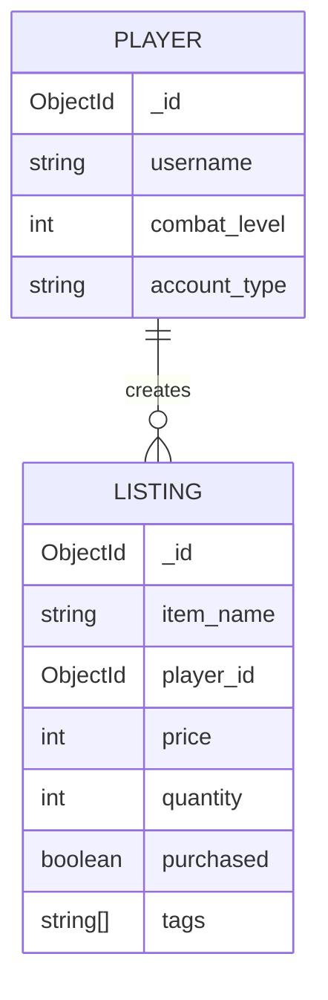

# nosql-course

### Entity Relationship Diagram for runescape_market:
- **PLAYER** entity can have **multiple LISTING** entities (one-to-many relationship).
- Each **LISTING** references a **PLAYER** via `player_id`.
- `PLAYER` stores the player's username, combat level, and account type as attributes with specified data types.
- `LISTING` contains item details, price, quantity, and status as attributes with specified data types.



---

**PLAYER JSON**

```
  {
    "_id": "507f191e810c19729de860ea",
    "username": "Zezima",
    "combat_level": 126,
    "account_type": "Regular"
  },
  {
    "_id": "507f191e810c19729de860eb",
    "username": "Iron Bob",
    "combat_level": 89,
    "account_type": "Ironman"
  }
```

**LISTING JSON**

```
  {
    "_id": "609c5a1b9b1d4c2f1e3f1a89",
    "player_id": "507f191e810c19729de860ea",
    "item_name": "Abyssal Whip",
    "price": 2000000,
    "quantity": 1,
    "purchased": true,
    "tags": ["abyssal", "slash"]

  },
  {
    "_id": "609c5a1b9b1d4c2f1e3f1a90",
    "player_id": "507f191e810c19729de860eb",
    "item_name": "Rune Scimitar",
    "price": 15000,
    "quantity": 2,
    "purchased": false,
    "tags": ["rune", "scimitar", "slash"]
  }
```
