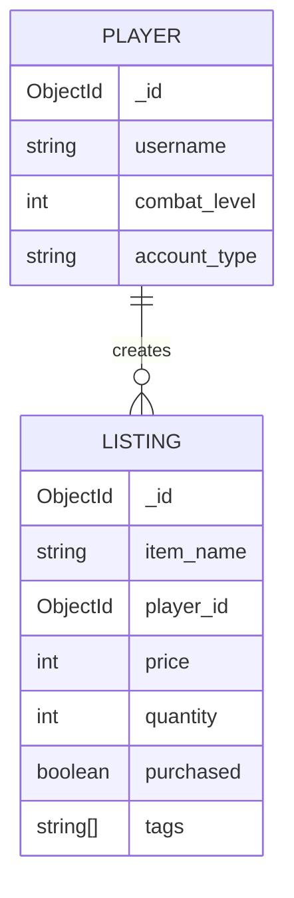

# MongoDB Exercises

## Exercise 1

### Insert a Single Document
```javascript
try {
   db.books.insertOne( {
       title: "Pride and Prejudice",
       author: "Jane Austen",
       year: 1813,
       genres: ["Romance", "Classic", "Fiction"],
       copies: 3,
       ebook: false
   });
} catch (e) {
   print(e);
}
```

### Insert Multiple Documents
```javascript
db.books.insertMany([
  { title: "War and Peace", author: "Leo Tolstoy", year: 1869, genres: ["Historical Fiction", "Classic", "Philosophical Fiction"], copies: 84, ebook: true },
  { title: "The Lord of the Rings: The Fellowship of the Ring", author: "John Ronald Reuel Tolkien", year: 1954, genres: ["Fantasy", "Adventure", "Epic"], copies: 0, ebook: false },
  { title: "Brave New World", author: "Aldous Huxley", year: 1931, genres: ["Dystopian", "Science Fiction", "Classic"], copies: 11, ebook: true },
  { title: "The Hobbit", author: "John Ronald Reuel Tolkien", year: 1937, genres: ["Fantasy", "Classic"], copies: 17, ebook: false }
]);
```

### List All Books
```javascript
db.books.find({})
```

## Exercises 2 & 3

### Find by Title
```javascript
db.books.find({ title: "To Kill a Mockingbird" })
db.books.find({ title: "The Hobbit" })
```

### Find by ID
```javascript
db.books.find({ _id: ObjectId("67a09582564fca59f78a7e99") })
```

### Find Books with More Than 15 Copies
```javascript
db.books.find({ copies: { $gt: 15 } })
```

### Find Books Authored by Leo Tolstoy Before 1890
```javascript
db.books.find({ author: "Leo Tolstoy", year: { $lt: 1890 } })
```

### Find Books by Jane Austen or Aldous Huxley
```javascript
db.books.find({ $or: [ { author: "Jane Austen" }, { author: "Aldous Huxley" } ] })
db.books.find({ author: { $in: ["Jane Austen", "Aldous Huxley"] } })
```

### Find Books Published Between 1900 and 2000
```javascript
db.books.find({ year: { $gt: 1900, $lt: 2000 } })
```

### Find Books with "Fantasy" or "Drama" Genre
```javascript
db.books.find({ genre: { $in: ["Fantasy", "Drama"] } })
db.books.find({ categories: { $in: ["Fantasy", "Drama"] } })
```

## Exercise 4: Updating Documents

### Update "The Hobbit" Year and Ebook Status
```javascript
db.books.updateOne({ title: "The Hobbit" }, { $set: { year: 1937, ebook: true } })
```

### Set Copies to Zero for Tolkien's Books
```javascript
db.books.updateMany({ author: "John Ronald Reuel Tolkien" }, { $set: { copies: 0 } })
```

### Increase Copies of Books Published After 1920 by Two
```javascript
db.books.updateMany({ year: { $gt: 1920 } }, { $inc: { copies: 2 } })
```

### Add "Adventure" Genre to "Moby-Dick"
```javascript
db.books.updateOne({ title: "Moby-Dick" }, { $push: { categories: "Adventure" } })
```

### Remove "Classic" Genre from "Anna Karenina"
```javascript
db.books.updateOne({ title: "Anna Karenina" }, { $pull: { categories: "Classic" } })
```

## Exercise 5: Deleting Documents

### Delete "Pride and Prejudice"
```javascript
db.books.deleteOne({ title: "Pride and Prejudice" })
db.listings.deleteOne({ _id: ObjectId('67c5b5c11058be0e7efeb3e3') })
```

### Delete Books with No Copies That Are Ebooks
```javascript
db.books.deleteMany({ $and: [ { copies: 0 }, { ebook: true } ] })
```

## Exercise 6: Aggregation

### Count Total Books
```javascript
db.books.aggregate([{ $count: "total_books" }])
```

### Sum of All Copies
```javascript
db.books.aggregate([{ $group: { _id: null, total_copies: { $sum: "$copies" } } }])
```

### Count Books by Author
```javascript
db.books.aggregate([{ $group: { _id: "$author", book_count: { $count: {} } } }])
```

### Sum of Copies by Author
```javascript
db.books.aggregate([{ $group: { _id: "$author", total_copies: { $sum: "$copies" } } }])
```

### Count Copies of Non-Ebook "Romance" Books
```javascript
db.books.aggregate([
  { $match: { ebook: false, genres: "Romance" } },
  { $group: { _id: null, total_copies: { $sum: "$copies" } } }
])
```

### Bonus: First and Latest Book Year per Author
```javascript
db.books.aggregate([
  { $group: { _id: "$author", first_book_year: { $min: "$year" }, latest_book_year: { $max: "$year" } } }
])
```

## Exercise 7: Referential Integrity Issue
In MongoDB, lack of referential integrity may cause issues when an author is deleted, leading to books referencing a non-existent author. This can break queries that expect an author field.

## Exercise 8: Entity Relationship Diagram

#### Entity Relationship Diagram for runescape_market:
- **PLAYER** entity can have **multiple LISTING** entities (one-to-many relationship).
- Each **LISTING** references a **PLAYER** via `player_id`.
- `PLAYER` stores the player's username, combat level, and account type as attributes with specified data types.
- `LISTING` contains item details, price, quantity, and status as attributes with specified data types.



## Exercise 9: Creating and Populating Database

### Create Database and Collections
```javascript
use runescape_market
```

### Insert Player Data
```javascript
try {
   db.players.insertMany([
{
"username": "Zezima",
"combat_level": 126,
"account_type": "Regular" },
    { "username": "Iron Bob",
"combat_level": 89,
"account_type": "Ironman"
}, ]);
} catch (e)
    { print(e);
};

```

### Insert Listing Data
```javascript
try {
  db.listings.insertMany([
    {
        "player_id": ObjectId("67c5b4c41058be0e7efeb3e1"),
        "item_name": "Abyssal Whip",
        "price": 2000000,
        "quantity": 1,
        "purchased": true,
        "tags": ["abyssal", "slash"]
    },
    {
        "player_id": ObjectId("67c5b4c41058be0e7efeb3e2"),
        "item_name": "Rune Scimitar",
        "price": 15000,
        "quantity": 2,
        "purchased": false,
        "tags": ["rune",
        "scimitar", "slash"]
    }
  ]);
} catch (e) {
  print(e);
}
```

